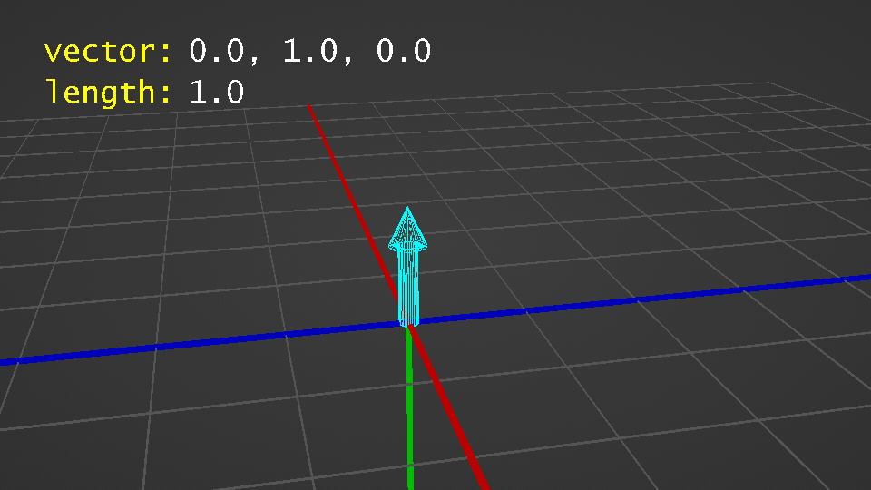
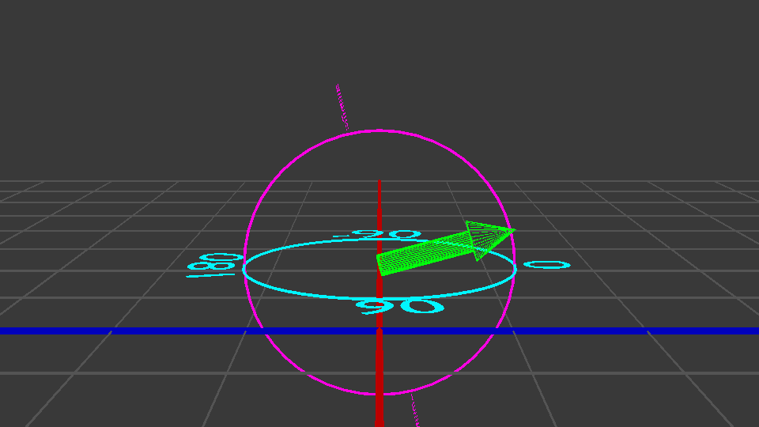

# Vectors in Skript

## Basic Vector Creation

The easiest way to create a vector in Skript is to literally define the XYZ values all at once, which can be either done with the `vector` function or the `vector` expression:

```vb

# Using the vector function
set {_v} to vector(0, 1, 0)

# Using the vector expression
set {_v} to vector 0, 1, 0

```


It does not matter which method you use; they produce the same result. I personally stick to using the function method for consistency's sake.


This is our X, Y, Z form, and it's the easiest to think about to start with. If I want to move 3 blocks in the X direction and -2 in the Z, I write `vector(3, 0, -2)`. It's very easy to translate to Minecraft's coordinates.&#x20;

If you were to visualize the vector `(0, 1, 0)`, it would look something like:

<figure><figcaption><p>A vector pointing directly up. (Credit: ThatOneWizard)</p></figcaption></figure>

The light blue arrow is the vector we just created. It's pointing straight up because we set the X and Z values to 0 and just the Y is 1.

In case the concept of looking at vectors from their individual components ( XYZ ) has not quite set in, here's a visualization of how the vector changes based on its components:&#x20;

<figure><figcaption><p>A vector being created from separate components (Credit: ThatOneWizard)</p></figcaption></figure>

The aqua arrow is the resulting vector and the red, green and blue arrows are the XYZ components.&#x20;

### XYZ Components

You can also get and modify the individual XYZ components of your vectors with the following syntax:

```applescript
[the] [vector] (x|y|z) [component[s]] of %vectors%
%vectors%'[s] [vector] (x|y|z) [component[s]]
```

```applescript
set {_v} to vector(1, 3, 5)
set x component of {_v} to 7
# v is now (7, 3, 5)
send {_v}'s z component to player
```

But remember, we have another way of describing vectors. Skript provides a way to use length, yaw, and pitch too!

### **Vector from Radius, Yaw, and Pitch**

This expression is identical to the previous, the only difference is that it allows you to adjust the length of the vector along with the yaw and pitch at the same time. &#x20;


Remember, vectors created with this syntax are no different from vectors created with other syntaxes. The name only refers to the way they're created.


The syntax looks like:

```vb

[new] spherical vector [(from|with)] [radius] %number%, [yaw] %number%(,| and) [pitch] %number%

```

And a simple example:

```vb

set {_v} to spherical vector radius 2, yaw 22.5, pitch 45

```

Now with this expression, it includes the term `spherical`, which just describes how the vector is being created, essentially a vector is just being made that goes from the center of a sphere to the outer edge.




You can also create a vector of length 1 using just yaw and pitch:

The expression looks like:

```vb
[a] [new] vector (from|with) yaw %number% and pitch %number%
```

Here's an example of creating a vector that points south and a little upwards:

```vb
set {_v} to vector from yaw 0 and pitch -15
```


### Other Ways to Make Vectors

There are a lot of other ways to get vectors in Skript, but the above three are the most common methods. You can learn about other methods here: [Other Ways to Create Vectors](other-ways-to-create-vectors.md).

***

## Basic Arithmetic

Just like with normal numbers, you can perform arithmetic ( math ) with vectors just as easily, the only difference is that you need to double the sign, ie `*` becomes `**.`

For the sake of example, we will be using the vector function to define the vectors here, but these could also be variables or other vector expressions like `player's velocity`.

```vb

set {_v} to vector(1, 2, 3) ++ vector(4, 5, 6)
# {_v} will be vector(5, 7, 9)

set {_v} to vector(1, 2, 3) -- vector(4, 5, 6)
# {_v} will be vector(-3, -3, -3)

set {_v} to vector(1, 2, 3) ** vector(4, 5, 6)
# {_v} will be vector(4, 10, 18)

set {_v} to vector(1, 2, 3) // vector(4, 5, 6)
# {_v} will be vector(0.25, 0.4, 0.5)

```


Currently the docs show that you are able to perform arithmetic with a vector and a scalar ( a single number ), which is no longer true.&#x20;

If you need to perform such operation, then simply replace the number with a vector where all 3 components are that number. For example, instead of `vector(1, 2, 3) * 5`, you would do `vector(1, 2, 3) ** vector(5, 5, 5)`


***

## Length

Along with having an XYZ, vectors also have a length, which is calculated from its XYZ components - it's simply done using the euclidean distance formula: `sqrt((x)^2 + (y)^2 + (z)^2)`.

You can literally think of the length as the length of the "arrow", from the base to the tip. Combining the concept of length and the XYZ components, we can see how the length changes as the XYZ components are changed, and in turn how the "arrow" looks:

The syntax for length is as follows:

```vb

[the] (vector|standard|normal) length[s] of %vectors%
%vectors%'[s] (vector|standard|normal) length[s]

```

And an example of getting the length:

```vb

set {_len} to vector length of vector(1, 2, 3)

```

The expression also allows you to modify the length, which will modify the components accordingly to meet that length:

```vb

set {_v} to vector(1, 2, 3)
send "vector: %{_v}%"
send "length: %vector length of {_v}%"

set vector length of {_v} to 10
send "vector: %{_v}%"
send "length: %vector length of {_v}%"

```

And if you run that code, you'll see a result similar to this:

```vb

vector: x: 1, y: 2, z: 3
length: 3.74

vector: x: 2.67, y: 5.34, z: 8.01
length: 10

```

***

## Yaw and Pitch

Last thing before we dive into the interesting stuff is yaw and pitch.

Yaw and pitch are values in degrees that define your view direction in the world. Yaw is your horizontal rotation ( left and right, like on a compass) and pitch is your vertical rotation ( up and down ), together they allow us to describe any looking direction with 2 numbers.

Yaw extends from 0 to 180, and then from -180 back to 0. South is 0, and 180/-180 is north. You can also use 0 to 360, where -90 is the same as 270.

Pitch extends from -90 to 90. 90 is straight down, -90 is straight up and 0 is straight forward.
