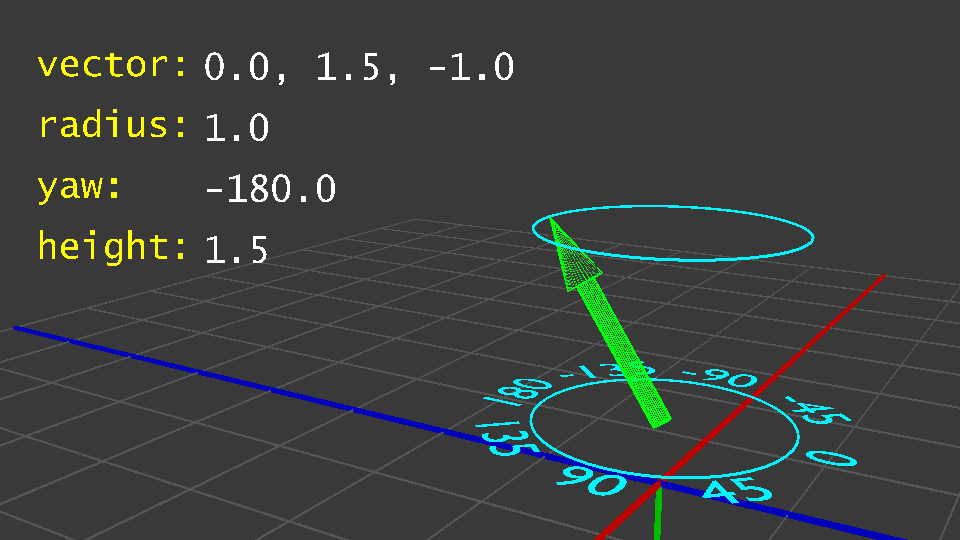

# Other Ways to Create Vectors

### **Vector from Radius, Yaw, and Height**

This expression creates a vector using a cylindrical shape, where the vector is made from the center of a cylinder to a point on the side at a specific height.

The syntax is as follows:

```vb

[a] [new] cylindrical vector [(from|with)] [radius] %number%, [yaw] %number%(,| and) [height] %number%

```

Now of course, similar setup to the other expressions:

```vb

set {_v} to cylindrical vector radius 2, yaw 45, height 5

```

And if you were to visualize the created vector:



***

### **Vector from Location**

This is a bit of a niche but simple expression, but it has uses so it will be discussed anyway.

All this expression does is return a vector with the same components as the input location:

```vb

[the] vector (of|from|to) %location%
%location%'s vector

```

And some examples:

```vb

set {_v} to vector from location of player

set {_v} to vector from location(0, 64, 0)

```

In the second example, the returned vector will become `vector(0, 64, 0)`.

And as you may have guessed, this does not make the returned value a location, it will be a vector. Which means that the other data ( such as world, yaw, and pitch ) will be lost.

***

### **Location from Vector**

Again this is a bit of a niche but simple expression, but it has uses so it will be discussed anyway.

This may come off as no surprise, but this expression does the opposite of the previous, it will take the components of the vector, a world, and optionally a yaw and pitch and turn it into a location:

```vb

%vector% [to location] [in] %world% 
location (from|of) %vector% [(from|in)] %world% 
%vector% [to location] [in] %world% with yaw %number% and pitch %number% 
location (from|of) %vector% [(in|from)] %world% with yaw %number% and pitch %number% 

```

```vb

set {_l} to vector(2, 4, 6) to location in world "world"

set {_myLoc} to location from vector(7, 8, 9) in world("world_the_end") with yaw 45 and pitch -90

```

If the yaw and pitch are not included, then both will be defaulted to 0.

***

### **Vector Between Locations**

This expression simply gets the vector from one location to another. In other words, can be thought of just subtracting the components from the first location by the second.

The returned vector "points" from the first location to the second, and the length being the distance between the two locations.

```vb

[the] vector (from|between) %location% (to|and) %location%

```

And can be used like:

```vb

set {_v} to vector between player and location(100, 16, 200)

```

If it still seems confusing, you can implement what this expression does by getting the vectors from both locations and then subtracting them:

```vb

set {_v1} to vector from location(0, 64, 0)

set {_v2} to vector from location(100, 32, -20)

set {_v3} to {_v2} -- {_v1}

```

But it's still recommended to use the built in expression for this, both for performance and cleanliness reasons.

***

### **Entity Velocity**

The velocity of something represents its speed and direction in meters per tick, which in Skript is represented as a vector ( yay ). Currently in Minecraft only entities have velocities.

```vb

[the] velocit(y|ies) of %entities%
%entities%'[s] velocit(y|ies)

```

Along with being able to get the velocity of an entity, we are able to modify it:

```vb

set {_v} to velocity of player
set {_v2} to {_v} ** vector(2, 2, 2) ++ vector(1, 2, -3)
set velocity of player to {_v2}

```


Having the vector `vector(1, 0, 0)` for example, as your velocity does not mean that you will be travelling exactly 1 meter per tick in the X direction, as the game has other calculations it performs when moving the entity, such as gravity and drag.


***

### **Random Vector**

This expression, as the same suggests, returns a random vector. More specifically, it returns a random unit vector where each component is a random number between `-1` and `1`, this expression is preferred when you need random vectors instead of generating the numbers yourself as the components.

```vb

[a] random vector

```

And the the code is as simple as you can get...

```vb

set {_v} to a random vector

```

As expected, every time that code is ran, `{_v}` will be a different vector every time.


In 2.6.4, this expression isn't fully random. The 3 random numbers have a bias towards pointing to the corners of a cube, like towards 1, 1, 1. This is fixed in 2.7.

